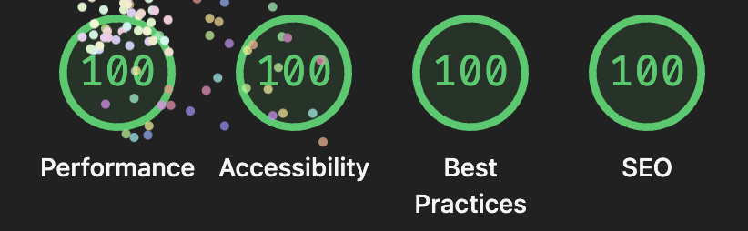

## Tierable
This project demonstrates a fully featured web application for creating and collaborating on tier lists. Users can create, edit, and delete their own tier lists as well as share their lists with others to allow them to vote. Implemented as a single page app using the History State API for navigations.

- Server: ExpressJS, using JSON and Cookie Session middleware.
- Results: Users can see a list of all of their tier lists on the main page, and clicking on a tier list shows a summary of all votes on that tier list.
- Form: Form to create/edit a tier list and voting form (and sign in/sign up forms)
- Persistent Data: The data is stored on MongoDB Atlas using the Mongoose library.
- CSS Framework: PicoCSS, with minor customizations.
- Authentication: Users can authenticate using a username and password (hashed/salted using Bcryptjs) or with GitHub OAuth. Upon signing in, users are assigned a token for subsequent requests which expires after 24 hours.

Render Link: https://a3-kyleplosky.onrender.com/

## Technical Achievements
- **OAuth Authentication:** Uses GitHub's OAuth capabilities as an option for signing in. Implemented from scratch, no OAuth library used.
- **100% in Lighthouse Tests:** All Lighthouse tests report a score of 100% on both the front page and the tier list page. I had to create a `robots.txt` file, add autocomplete hints to the sign in and sign up forms, and make some adjustments to the order that page resources were loaded in order to achieve this.
